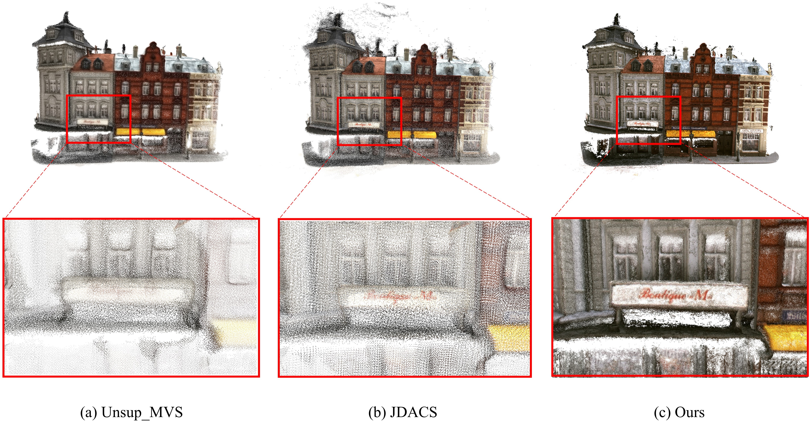

<div align="center">
  <h1 align="center">RC-MVSNet: Unsupervised Multi-View Stereo with Neural Rendering</h1>

  <p align="center">
    <a href="https://boese0601.github.io">Di Chang</a><sup>1</sup>,
	<a href=https://aljazbozic.github.io/ target=_blank rel=noopener>Aljaž Božic</a><sup>1</sup>, 
    <a href="https://people.epfl.ch/tong.zhang?lang=en" target=_blank rel=noopener>Tong Zhang</a><sup>2</sup>, 
      Qingsong Yan<sup>3</sup>, 
    Yingcong Chen<sup>3</sup>, 
    <a href=https://people.epfl.ch/sabine.susstrunk target=_blank rel=noopener>Sabine Süsstrunk</a><sup>2</sup> and <a href=https://niessnerlab.org/ target=_blank rel=noopener>Matthias Nießner</a><sup>1</sup>
      <br>
      <sup>1</sup>TUM
      <sup>2</sup>EPFL
      <sup>3</sup>HKUST
    <br />
    <strong>ECCV 2022</strong>
    <br />
    <a href="https://arxiv.org/abs/2203.03949">Arxiv</a> | <a href="https://niessnerlab.org/projects/chang2022rcmvsnet.html">Project page</a>
    <br />
  </p>

## Introduction

This is the official pytorch implementation of our ECCV2022 paper: RC-MVSNet: Unsupervised Multi-View Stereo with Neural Rendering. In this work, we introduce RC-MVSNet, a neural-rendering based unsupervised Multi-View Stereo 3D reconstruction approach. First, we leverage NeRF-like rendering to generate consistent photometric supervision for non-Lambertian surfaces in unsupervised MVS task. Second, we impose depth rendering consistency loss to refine the initial depth map predicted by naive photometric consistency loss. We also propose Gaussian-Uniform sampling to improve NeRF's ability to learn the geometry features close to the object surface, which overcomes occlusion artifacts present in existing approaches. We achieved state-of-the-art performance on DTU and Tanks\&Temples benchmarks and competitive performance to many supervised methods.



## Installation

Clone repo:
```
git clone https://github.com/Boese0601/RC-MVSNet.git
cd RC-MVSNet
```

The code is tested with Python == 3.7, PyTorch == 1.10.1 and CUDA == 11.3 on NVIDIA GeForce RTX 3090. We recommend you to use [anaconda](https://www.anaconda.com/) to manage dependencies. You may need to change the torch and cuda version in the `requirements.txt` according to your computer.
```
conda create -n rcmvsnet python=3.7
conda install pytorch==1.10.1 torchvision==0.11.2 torchaudio==0.10.1 cudatoolkit=11.3 -c pytorch -c conda-forge
conda activate rcmvsnet
pip install -r requirements.txt
```

## Datasets

### DTU

**Training**

Download the [DTU dataset](https://drive.google.com/file/d/1eDjh-_bxKKnEuz5h-HXS7EDJn59clx6V/view) pre-processed by [MVSNet](https://github.com/YoYo000/MVSNet) and extract the archive. You could use [gdown](https://github.com/wkentaro/gdown) to download it form Google Drive. You could refer to [MVSNet](https://github.com/YoYo000/MVSNet) for the detailed documents of the file formats.

Download the original resolution [depth maps](https://drive.google.com/open?id=1LVy8tsWajG3uPTCYPSxDvVXFCdIYXaS-) provided by [YaoYao](https://github.com/YoYo000/MVSNet/issues/106). Extract it and rename the folder to `Depths_raw`. 

Merge the folders together and you should get a dataset folder like below:

```
dtu
├── Cameras
├── Depths
├── Depths_raw
└── Rectified
```

**Testing**

Download the [DTU testing dataset](https://drive.google.com/file/d/135oKPefcPTsdtLRzoDAQtPpHuoIrpRI_/view) pre-processed by [MVSNet](https://github.com/YoYo000/MVSNet) and extract the archive. You could use [gdown](https://github.com/wkentaro/gdown) to download it form Google Drive. You could refer to [MVSNet](https://github.com/YoYo000/MVSNet) for the detailed documents of the file formats. 

```
dtu_test
├── scan1
├── scan4
├── scan9
...
├── scan114
└── scan118
```


### Tanksandtemples(Only for Testing)

Download the [Tanks and Temples testing set](https://drive.google.com/open?id=1YArOJaX9WVLJh4757uE8AEREYkgszrCo) pre-processed by [MVSNet](https://github.com/YoYo000/MVSNet). For the `intermediate` subset, remember to replace the cameras by those in `short_range_caemeras_for_mvsnet.zip` in the `intermediate` folder, see [here](https://github.com/YoYo000/MVSNet/issues/14). You should get a dataset folder like below:

```
tankandtemples
├── advanced
│   ├── Auditorium
│   ├── Ballroom
│   ├── Courtroom
│   ├── Museum
│   ├── Palace
│   └── Temple
└── intermediate
    ├── Family
    ├── Francis
    ├── Horse
    ├── Lighthouse
    ├── M60
    ├── Panther
    ├── Playground
    └── Train
```

## Configure

There are several options of flags at the beginning of each train/test file. Several key options are explained below. Other options are self-explanatory in the codes. Before running our codes, you may need to change the `true_gpu`, `trainpath/testpath` , `logdir`and `loadckpt` (only for testing).

* `logdir` A relative or absolute folder path for writing logs.
* `true_gpu` The true GPU IDs, used for setting CUDA_VISIBLE_DEVICES in the code. You may change it to your GPU IDs.
* `gpu` The GPU ID used in your experiment. If true_gpu: "5, 6". Then you could use gpu: [0], gpu: [1], or gpu: [0, 1]
* `loadckpt` The checkpoint file path used for testing.
* `trainpath/testpath` A relative or absolute folder path for training or testing data. You may need to change it to your data folder.
* `outdir` A relative or absolute folder path for generating depth maps and writing point clouds(DTU).
* `plydir` A relative or absolute folder path for writing point clouds(Tanks).
* `dataset` Dataset to be used. ["dtu_train","dtu_test","tanks"]
* `resume` Resume training from the latest history.

## Training

Train the model on DTU dataset
```
python train_rcmvsnet.py --logdir ./rc-mvsnet --trainpath {your data dir} --dataset dtu_train --gpu [0,1,2,3] --true_gpu 0,1,2,3 
```

## Testing

### **DTU**

We have provided pre-trained model in the `pretrain` folder, which contains models for both backbone network and rendering consistency network, only the backbone network (ended with 'cas') is used for testing as mentioned in the paper. The rendering consistency network (ended with 'nerf') is used for resume training from the current epoch. 

You could use `eval_rcmvsnet_dtu.py` to reconstruct depthmaps and point clouds with the checkpoint. To reproduce the DTU results in our paper, run commands below:

```
python eval_rcmvsnet_dtu.py
```
After you get the point clouds, you could follow the instructions in [DTU](http://roboimagedata.compute.dtu.dk/?page_id=36) website to quantitatively evaluate the point clouds.

**DTU Point Cloud Evaluation**

We provide evaluation code in the `matlab_eval` folder. The code relies on the official code of [DTU](http://roboimagedata.compute.dtu.dk/?page_id=36) Dataset. Please use  `BaseEvalMain_web_pt.m`, `ComputeStat_web_pt.m` and `compute_mean.m` for evaluation. 

* `gt_datapath` The path to the ground truth point clouds.
* `dataPaths` The path to the generated point clouds of RC-MVSNet.
* `resultsPaths` The path to output metrics of the evaluation script.

### Tanksandtemples

To reproduce the Tanksandtemples results in our paper, run commands below:
```
python eval_rcmvsnet_tanks.py --split "intermediate" --loadckpt "./pretrain/model_000014_cas.ckpt"  --plydir "./tanks_submission" --outdir './tanks_exp' --testpath {your data dir}
```
```
python eval_rcmvsnet_tanks.py --split "advanced"  --loadckpt "./pretrain/model_000014_cas.ckpt" --plydir "./tanks_submission" --outdir './tanks_exp' --testpath {your data dir}
```
After you get the point clouds, you could submit them to the [Tanksandtemples](https://www.tanksandtemples.org/) website for quantitative evaluatation.

<!-- LICENSE -->
## License

Our code is distributed under the MIT License. See `LICENSE` file for more information.

## Citation

```bibtex
@article{chang2022rc,
  title={RC-MVSNet: Unsupervised Multi-View Stereo with Neural Rendering},
  author={Chang, Di and Bo{\v{z}}i{\v{c}}, Alja{\v{z}} and Zhang, Tong and Yan, Qingsong and Chen, Yingcong and S{\"u}sstrunk, Sabine and Nie{\ss}ner, Matthias},
  journal={arXiv preprint arXiv:2203.03949},
  year={2022}
}
```

## Contact

If you have any questions, please raise an issue or email to Di Chang (`di.chang@tum.de`or `dichang@usc.edu`).

## Acknowledgments

Our code follows several awesome repositories. We appreciate them for making their codes available to public.

* [MVSNet](https://github.com/YoYo000/MVSNet)
* [GBi-Net](https://github.com/MiZhenxing/GBi-Net)
* [MVSNet_pytorch](https://github.com/xy-guo/MVSNet_pytorch)
* [CasMVSNet](https://github.com/alibaba/cascade-stereo/tree/master/CasMVSNet)
* [PatchmatchNet](https://github.com/FangjinhuaWang/PatchmatchNet)
* [MVSNeRF](https://github.com/apchenstu/mvsnerf)
* [U-MVSNet](https://github.com/ToughStoneX/U-MVS)
* [JDACS](https://github.com/ToughStoneX/Self-Supervised-MVS)